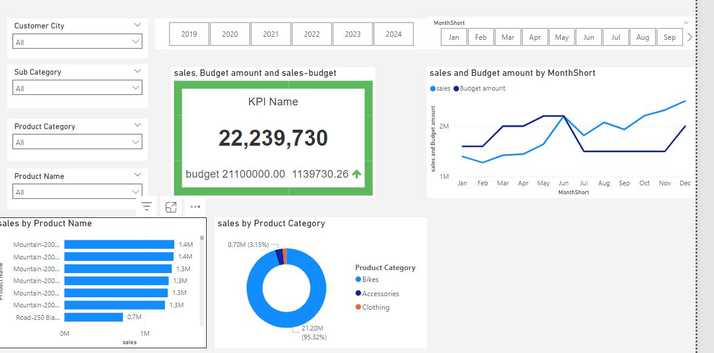

# Power BI Dashboard: Internet Sales Overview

## Project Overview

This Power BI project focuses on visualizing **Internet Sales** data to provide insights into overall sales performance, sales distribution across different customer segments, and sales trends for individual products. The dashboard helps in making data-driven decisions by showcasing key metrics and trends.

---

### Features

- **Total Internet Sales Overview**: A high-level visualization of total internet sales, including historical trends and year-over-year comparisons.
- **Internet Sales by Customer Segment**: Breakdowns of sales across different customer segments, including demographics, location, and purchase frequency.
- **Internet Sales by Product Category**: Insights into which product categories contribute the most to sales, including detailed product-level analysis.
- **Top Customers and Products**: Highlighting top-performing customers and products, based on sales volume and revenue.

### Data Sources
The dataset used in this dashboard includes:
- **Customer Information**:  [Exported Data - DIM_Customers.csv](https://github.com/salmamamdouh/PBI_SQL_SalesAnalysis/blob/main/Exported%20Data%20-%20DIM_Customers.csv).
- **Sales Data**: [Exported Data - FACT_InternetSales.csv](https://github.com/salmamamdouh/PBI_SQL_SalesAnalysis/blob/main/Exported%20Data%20-%20FACT_InternetSales.csv).
- **Product Information**: [Exported Data - DIM_Products.csv](https://github.com/salmamamdouh/PBI_SQL_SalesAnalysis/blob/main/Exported%20Data%20-%20DIM_Products.csv).
- **Calendar Information**: [Exported Data - DIM_Calendar.csv](https://github.com/salmamamdouh/PBI_SQL_SalesAnalysis/blob/main/Exported%20Data%20-%20DIM_Calendar.csv).

  ---

The data for this project was extracted and transformed using SQL. Below are the SQL scripts used to prepare the data for analysis.

- [SQL Script - DIM_Calendar.sql](https://github.com/salmamamdouh/PBI_SQL_SalesAnalysis/blob/main/SQL%20Script%20-%20DIM_Calendar.sql)
- [SQL Script - DIM_Customers.sql](https://github.com/salmamamdouh/PBI_SQL_SalesAnalysis/blob/main/SQL%20Script%20-%20DIM_Customers.sql)
- [SQL Script - DIM_Products.sql]([./sql/product_data_preparation.sql](https://github.com/salmamamdouh/PBI_SQL_SalesAnalysis/blob/main/SQL%20Script%20-%20DIM_Products.sql))
- [SQL Script - FACT_InternetSales.sql](https://github.com/salmamamdouh/PBI_SQL_SalesAnalysis/blob/main/SQL%20Script%20-%20FACT_InternetSales.sql)

You can view or download the SQL code from the links provided above to understand how the data was structured and transformed for use in Power BI.

---
# Sales Dashboard

## Description
Developed and designed an interactive sales dashboard providing comprehensive insights into sales performance, budget comparison, and product category trends. Features include:
- Dynamic filters for customer city, product categories, and timeframes.
- A KPI summary displaying sales-to-budget variance.
- Visualizations such as line charts and pie charts for data-driven decision-making.

## Preview

